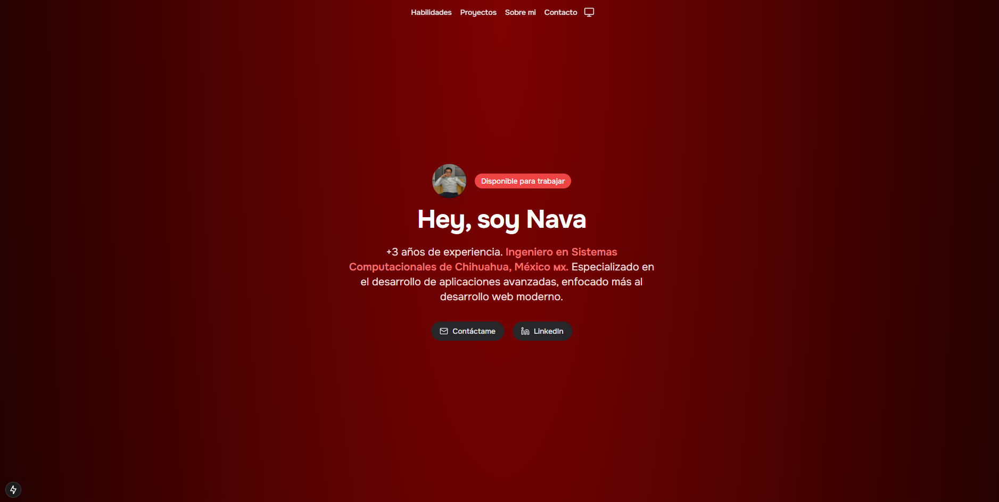

# 👨🏻‍💻 Portafolio de José Nava

  

  ¡Bienvenido a mi portafolio! Soy José Nava, un desarrollador web apasionado por crear experiencias digitales innovadoras y funcionales. 
  Este proyecto está diseñado para mostrar mis habilidades técnicas, proyectos destacados y enfoque profesional.

---

## 🌟 Tecnologías utilizadas

Este portafolio fue construido utilizando las siguientes tecnologías:

   
  
  
    

### 🚀 Características principales
- **Next.js**: Framework de React para crear aplicaciones web modernas con un rendimiento optimizado.
- **Tailwind CSS**: Framework CSS utilitario para un diseño rápido, flexible y altamente personalizable.